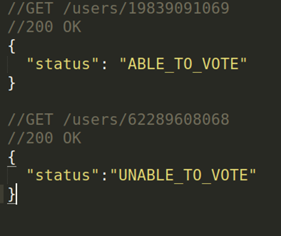
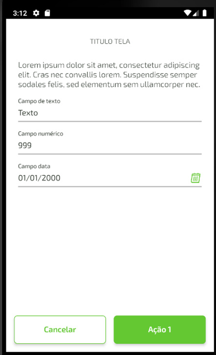
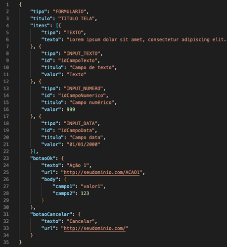
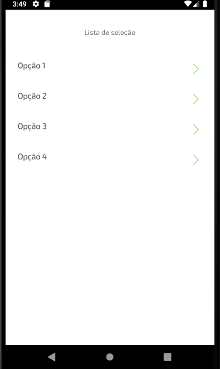
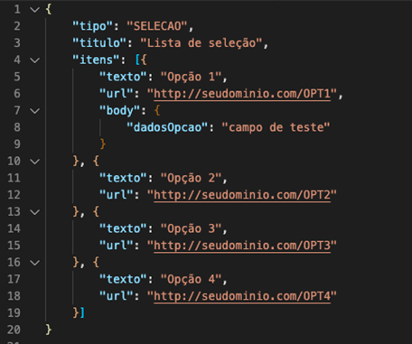

# Avaliação técnica 

## Objetivo

No cooperativismo, cada associado possui um voto e as decisões são tomadas em assembleias, por votação. Imagine que você deve criar uma solução para dispositivos móveis para gerenciar e participar dessas sessões de votação.

Essa solução deve ser executada na nuvem e promover as seguintes funcionalidades através de uma API REST:
*	Cadastrar uma nova pauta
*	Abrir uma sessão de votação em uma pauta (a sessão de votação deve ficar aberta por um tempo determinado na chamada de abertura ou 1 minuto por default)
*	Receber votos dos associados em pautas (os votos são apenas 'Sim'/'Não'. Cada associado é identificado por um id único e pode votar apenas uma vez por pauta)
*	Contabilizar os votos e dar o resultado da votação na pauta

Para fins de exercício, a segurança das interfaces pode ser abstraída e qualquer chamada para as interfaces pode ser considerada como autorizada. A solução deve ser construída em java, usando Spring-boot, mas os frameworks e bibliotecas são de livre escolha (desde que não infrinja direitos de uso).

É importante que as pautas e os votos sejam persistidos e que não sejam perdidos com o restart da aplicação.

O foco dessa avaliação é a comunicação entre o backend e o aplicativo mobile. Essa comunicação é feita através de mensagens no formato JSON, onde essas mensagens serão interpretadas pelo cliente para montar as telas onde o usuário vai interagir com o sistema. A aplicação cliente não faz parte da avaliação, apenas os componentes do servidor. O formato padrão dessas mensagens será detalhado no anexo 1.

## Tarefas bônus

*	Tarefa Bônus 1 - Integração com sistemas externos

    *	Integrar com um sistema que verifique, a partir do CPF do associado, se ele pode votar
    *	GET https://user-info.herokuapp.com/users/{cpf}
    *	Caso o CPF seja inválido, a API retornará o HTTP Status 404 (Not found). Você pode usar geradores de CPF para gerar CPFs válidos
    *	Caso o CPF seja válido, a API retornará se o usuário pode (ABLE_TO_VOTE) ou não pode (UNABLE_TO_VOTE) executar a operação. Essa operação retorna resultados aleatórios, portanto um mesmo CPF pode funcionar em um teste e não funcionar no outro.

Exemplos de retorno do serviço

*	Tarefa Bônus 2 - Performance

    *       Imagine que sua aplicação possa ser usada em cenários que existam centenas de milhares de votos. Ela deve se comportar de maneira performática nesses cenários
    *	Testes de performance são uma boa maneira de garantir e observar como sua aplicação se comporta
    *	Tarefa Bônus 3 - Versionamento da API
    *	Como você versionaria a API da sua aplicação? Que estratégia usar?

*	Tarefa Bônus 3 - Versionamento da API   
    
    * 	Como você versionaria a API da sua aplicação? Que estratégia usar?

## O que será analisado

    ●	Simplicidade no design da solução (evitar over engineering)
    ●	Organização do código
    ●	Arquitetura do projeto
    ●	Boas práticas de programação (manutenibilidade, legibilidade etc)
    ●	Possíveis bugs
    ●	Tratamento de erros e exceções
    ●	Explicação breve do porquê das escolhas tomadas durante o desenvolvimento da solução
    ●	Uso de testes automatizados e ferramentas de qualidade
    ●	Limpeza do código
    ●	Documentação do código e da API
    ●	Logs da aplicação
    ●	Mensagens e organização dos commits

## Dicas

    ●	Teste bem sua solução, evite bugs
    ●	Deixe o domínio das URLs de callback passiveis de alteração via configuração, para facilitar o teste tanto no emulador, quanto em dispositivos fisicos.

## Observações importantes

    ●	Não inicie o teste sem sanar todas as dúvidas
    ●	Iremos executar a aplicação para testá-la, cuide com qualquer dependência externa e deixe claro caso haja instruções especiais para execução do mesmo

## Anexo 1

### Introdução

A seguir serão detalhados os tipos de tela que o cliente mobile suporta, assim como os tipos de campos disponíveis para a interação do usuário

### Tipo de tela – FORMULARIO

A tela do tipo FORMULARIO exibe uma coleção de campos (itens) e possui um ou dois botões de ação na parte inferior. A seguir temos um exemplo do objeto JSON e de como a tela é exibida pelo app.

O aplicativo envia uma requisição POST para a url informada e com o body definido pelo objeto dentro de cada botão quando o mesmo é acionado. Nos casos onde temos campos de entrada de dados na tela, os valores informados pelo usuário são adicionados ao corpo da requisição. Abaixo o exemplo da requisição que o aplicativo vai fazer quando o botão “Ação 1” for acionado:

    POST http://seudominio.com/ACAO1
    {
        “campo1”: “valor1”,
        “campo2”: 123,
        “idCampoTexto”: “Texto”,
        “idCampoNumerico: 999
        “idCampoData”: “01/01/2000”
    }

Obs: o formato da url acima é meramente ilustrativo e não define qualquer padrão de formato.

### Tipo de tela - SELECAO

A tela do tipo SELECAO exibe uma lista de opções para que o usuário.

O aplicativo envia uma requisição POST para a url informada e com o body definido pelo objeto dentro de cada item da lista de seleção, quando o mesmo é acionado, semelhando ao funcionamento dos botões da tela FORMULARIO.
